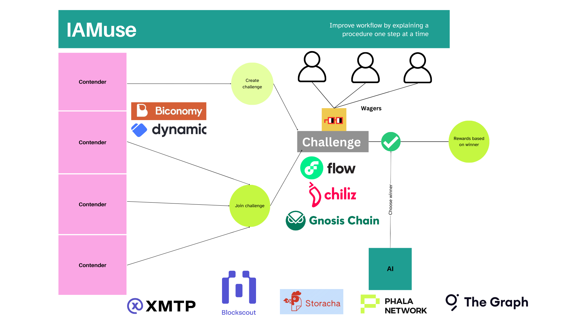

# Introduction

IAmuse aspires to be a platform that can be used to derive the value of any item using a prediction market. 

## Hackathon Use Case

In the eth global hack we plan to showcase how this can platform can be used to provide an interesting community activity, at the same time also allow for valuation of nouns.wtf art. 

The below excalidraw represents the application that we plan to build using circles ubi / kinto.xyz since they provide us with some form of sybil resistance.

  

## Phala 
curl https://wapo-testnet.phala.network/ipfs/Qmc7zrN4Pen3ML7FHfoBEZpAosUjtK3fKBvh81ndbTeDy7?key=6742e16566409f95&type=challenge
curl https://wapo-testnet.phala.network/logs/all/ipfs/QmXaXHKHY6usYaVfGHipqKTgtLmJEuaPppk3P1qHAsxteC\?key\=82ff40c7e5977a08

Logs Shared - 

https://red-pill.ai/shares/aaa73668-00aa-4728-a1f2-7d00afedd78a

 

### Contract deployments

**Gnosis Chiado**

| Contract | Address  |
| :----- | :- |
| GameController | [`0xbda16b92cda4efdb6b059ed77b98bfcbda29973f`](https://gnosis-chiado.blockscout.com/address/0xbda16b92cda4efdb6b059ed77b98bfcbda29973f)|

**Chiliz Spicy**

| Contract | Address  |
| :----- | :- |
| GameFactory | [`0x8CFfFB42c942190d6e7fF2e3fcf1Fae1C772E323`](https://testnet.chiliscan.com/address/0x8CFfFB42c942190d6e7fF2e3fcf1Fae1C772E323)|
| Game base implementation | [`0xCEC24cFeca71A6Afd17b13363a0f2348DfAc295e`](https://testnet.chiliscan.com/address/0xCEC24cFeca71A6Afd17b13363a0f2348DfAc295e)|
| ConditionalTokens  | [`0xCEC24cFeca71A6Afd17b13363a0f2348DfAc295e`](https://testnet.chiliscan.com/address/0xcec24cfeca71a6afd17b13363a0f2348dfac295e) |
| USDX | [`0xe62bc5aac85e4e2e39888236a3b7128e69d9f6c3`](https://testnet.chiliscan.com/address/0xe62bc5aac85e4e2e39888236a3b7128e69d9f6c3)|

**Flow Testnet**

| Contract | Address  |
| :----- | :- |
| GameFactory | [`0x216205E0EEDAdcc15ee46D0965E217BCF91E881D`](https://evm-testnet.flowscan.io/address/0x216205E0EEDAdcc15ee46D0965E217BCF91E881D)|
| Game base implementation | [`0x37ce7eF05E7D93EeD602bB3A5352BC625578862C`](https://evm-testnet.flowscan.io/address/0x37ce7eF05E7D93EeD602bB3A5352BC625578862C)|
| ConditionalTokens  | [`0xaA3117cb5E45C6b4ACEaFb7D2AA011435f3cCe92`](https://evm-testnet.flowscan.io/address/0xaA3117cb5E45C6b4ACEaFb7D2AA011435f3cCe92) |
| USDX | [`0xd3d940D07Cea99E1aDc52dF368DfBA87558DE637`](https://evm-testnet.flowscan.io/address/0xd3d940D07Cea99E1aDc52dF368DfBA87558DE637)|
